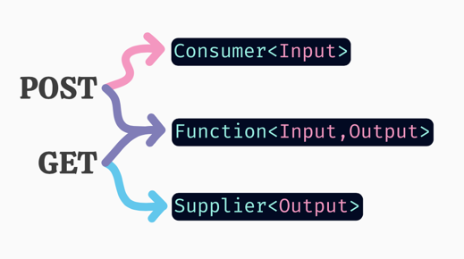

## Spring Cloud Function POC

### AWS Lambda with RDS

Please read [AWS Lambda Ready](https://github.com/asharmabuckle/spring-cloud-functions/blob/aws-lambda-ready/README.md)
you proceed.

This branch introduces Supplier to mix. Following above guideline, our only JPA function requires no input hence
Supplier is used.
Demonstrating a JPA and JDBC connectivity to a postgres RDS DB, this function is queries ROWCOUNT and returns a
POJO (jsonified by framework).

**Caution:**
JPA required considerably high memory than JDBC. For this POC, lambda is set to 1 GB.

### Test this branch

* AWS Lambda function is deployed in dataluss-np account, function name spring-cf. This function is also exposed using
  function URL
  - `curl --location --request GET 'https://klej3attpxuzdjtbncxb36q2y40jkpgf.lambda-url.us-west-2.on.aws/'`

* Other functions can still be invoked from their relative paths
  * JPAasSupplier `curl localhost:8080/jpasupplier`
  * JDBCasSupplier `curl localhost:8080/jdbcsupplier`
  * CompositeFunction `curl -H "Content-Type: text/plain" localhost:8080/ -d 'Buckle. Before Anything Else'`
  * Upper Case `curl -H "Content-Type: text/plain" localhost:8080/uppercase -d 'Buckle. Before Anything Else'`
  * Reverse String `curl -H "Content-Type: text/plain" localhost:8080/reversestring -d 'Buckle. Before Anything Else'`

### Reference Documentation

[Official Spring AWS Lambda Documentation](https://docs.spring.io/spring-cloud-function/docs/current/reference/html/aws.html)

[SpringBoot Thin Launcher](https://github.com/spring-projects-experimental/spring-boot-thin-launcher)

[**Working** Shade Plugin](https://plugins.gradle.org/plugin/com.github.johnrengelman.shadow)
